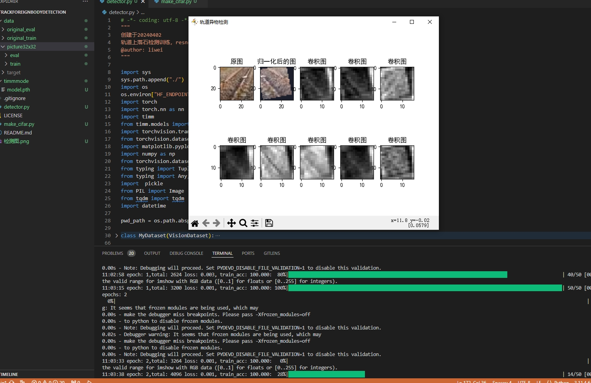
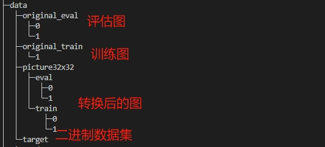

# trackforeignbodydetection 说明
Track foreign body detection based on resnet18 model of timm  
实验训练好的模型已保存在模型文件夹timmmode下  
创建类似cifar数据集的文件 python make_cifar.py  
轨道检测异物训练文件： python detector.py  
# 检测图


# 训练数据集



直接上代码  
```
# -*- coding: utf-8 -*-
"""
创建于20240402
轨道上落石检测训练，resnet残差网络
@author: liwei
"""

import sys
sys.path.append("./")
import os
os.environ["HF_ENDPOINT"] = "https://hf-mirror.com"
import torch
import torch.nn as nn
import timm
from timm.models import ResNet
import torchvision.transforms as transforms
from torchvision.datasets import CIFAR10
import matplotlib.pyplot as plt
import numpy as np
from torchvision.datasets.vision import VisionDataset 
from typing import Tuple,Any
from typing import Any, Callable, Optional, Tuple
import  pickle
from PIL import Image
from tqdm import tqdm
import datetime

pwd_path = os.path.abspath(os.path.dirname(__file__))

class MyDataset(VisionDataset):
    def __init__(
        self,
        data_path: str,
        transform: Optional[Callable] = None
    ) -> None:

        # super().__init__(root, transform=transform, target_transform=target_transform)
        with open(data_path, 'rb') as fo:
            dict = pickle.load(fo, encoding='latin-1')
        self.labels = dict['labels'.encode('utf-8')]
        self.imgs = dict['imgs'.encode('utf-8')]
        self.classes=dict['classes'.encode('utf-8')]
        self.transform = transform
    def __getitem__(self, index: int) -> Tuple[Any, Any]:
        """
        Args:
            index (int): Index

        Returns:
            tuple: (image, target) where target is index of the target class.
        """
        index = index%len(self.imgs)
        img, target = self.imgs[index], self.labels[index]

        # doing this so that it is consistent with all other datasets
        # to return a PIL Image

        if self.transform is not None:
            img = self.transform(img)

        return img, target

    def __len__(self) -> int:
        return 64*50
        # return len(self.imgs)

class MyCIFAR10(VisionDataset):
    def __init__(
            self,
            train,
            origin
        ) -> None:
        self.train = train
        self.origin = origin
    def __getitem__(self, index: int) -> Tuple[Any, Any, Any, Any]:
        img, label =self.train[index]
        imgOrigin, labelOrigin = self.origin[index]

        return img, label, imgOrigin, labelOrigin
    def __len__(self):
        return len(self.train)
def get_data_loader():
    global train_transforms
    global test_transforms
        # 数据增强
    train_transforms = transforms.Compose([
        transforms.RandomCrop(size=32, padding=4),
        transforms.RandomHorizontalFlip(p=0.5),
        transforms.RandomRotation(degrees=15),
        transforms.ToTensor(),
        transforms.Normalize([0.43588707, 0.41892126, 0.37087828], [0.18812412, 0.18614522, 0.1920109])
    ])

    test_transforms = transforms.Compose([
        transforms.ToTensor(),
        transforms.Normalize([0.43588707, 0.41892126, 0.37087828], [0.18812412, 0.18614522, 0.1920109])
        # transforms.Normalize([0.5, 0.5, 0.5], [0.5, 0.5, 0.5])
    ])

    original_transforms = transforms.Compose([
        # transforms.RandomCrop(size=32, padding=4),
        transforms.ToTensor()
    ])

    # 数据集
    # train_dataset = CIFAR10(root='data', train=True, download=True, transform=train_transforms)
    # test_dataset = CIFAR10(root='data', train=False, download=True, transform=test_transforms)
    # original_dataset = CIFAR10(root='data', train=True, download=True, transform=original_transforms)
    binTrain=pwd_path+"\\data\\target\\train.bin"
    binEval=pwd_path+"\\data\\target\\eval.bin"
    train_dataset = MyDataset(data_path=binTrain, transform=train_transforms)
    test_dataset = MyDataset(data_path=binEval,  transform=test_transforms)
    original_dataset = MyDataset(data_path=binTrain, transform=original_transforms)
    # DataLoader
    train_loader = torch.utils.data.DataLoader(MyCIFAR10(train_dataset,original_dataset), batch_size=64, shuffle=True, num_workers=2)
    test_loader = torch.utils.data.DataLoader(test_dataset, batch_size=64, shuffle=False, num_workers=2)   
    return train_loader, test_loader,len(train_dataset.classes)

def test(model,path):
    model.eval()
    with torch.no_grad():
        x_s=32
        y_s=32
        im=Image.open(path)
        out = im.resize((x_s,y_s),Image.LANCZOS)
        img = test_transforms(out)
        outputs = model(img.reshape(1,3,32,32))
        _, predicted = torch.max(outputs.data, 1)
        return predicted

def eval():
    model :ResNet= timm.create_model('resnet18', pretrained=False)
    # 修改分类器
    inFeatures = model.fc.in_features
    model.fc = nn.Linear(inFeatures, classes_len)
    model.load_state_dict(torch.load('./timmmode/model.pth'))
    model.eval()
    # test(model=model,path='data\\original_eval\\1\\1_000.jpg')    
    with torch.no_grad():
        correct = 0
        total = 0
        for i,(images, labels) in  enumerate(test_loader):
            outputs = model(images)
            _, predicted = torch.max(outputs.data, 1)
            total += labels.size(0)
            correct += (predicted == labels).sum().item()
            print('it: {} Accuracy: {:.2f}%'.format(i+1, 100*correct/total))

if __name__ == '__main__':  

    plt.rcParams["font.sans-serif"] = "SimHei"
    plt.rcParams["axes.unicode_minus"] = False

    train_loader, test_loader, classes_len = get_data_loader()  
    
    # 加载预训练模型
    model :ResNet= timm.create_model('resnet18', pretrained=False)
    # 修改分类器
    num_ftrs = model.fc.in_features
    model.fc = nn.Linear(num_ftrs,classes_len)
    model.load_state_dict(torch.load(pwd_path+'./timmmode/model.pth'))
    # 损失函数
    criterion = nn.CrossEntropyLoss()
    # 优化器
    optimizer = torch.optim.SGD(model.parameters(), lr=0.001, momentum=0.9)
    num_epochs = 200
    plt.ion()
    plt.figure('轨道异物检测')

    correct=0  
    total=0   
    for epoch in range(num_epochs):
        print('epochs:',epoch+1)
        iterator = tqdm(train_loader,ncols=200,colour='green')
        # 训练
        model.train()
        # for images, labels, imagesOrigin, labelsOrigin in train_loader:
        for i,(images, labels, imagesOrigin, labelsOrigin) in enumerate(iterator):

            # 前向传播
            outputs = model(images)
            # 计算损失
            loss = criterion(outputs, labels)
            # 反向传播
            optimizer.zero_grad()
            loss.backward()
            optimizer.step()            
           
            _, predicted = torch.max(outputs.data, 1)
            correct += (predicted == labels).sum().item()
            total += images.size(0)

            # print('total: {},loss: {:.3f}'.format(total, loss))
            status = f"{datetime.datetime.now().time().strftime('%H:%M:%S')} epoch: {epoch+1},total: {total} loss: {loss:.3f}, train_acc: {100*correct/total:.3f}"
            iterator.set_description(status)    

            #每10iteration进行图像显示，卷积后的图像显示 
            if i%10==0:
                plt.subplot(2,5,1)
                plt.title("原图")
                plt.imshow(np.stack((imagesOrigin[5][0],imagesOrigin[5][1],imagesOrigin[5][2]),axis=2))
                plt.subplot(2,5,2)
                plt.title("归一化后的图")
                # 0-1区间的img值，归一化造成有负值
                plt.imshow(np.stack((images[5][0]+3,images[5][1]+3,images[5][2]+3),axis=2)/6)
                img=model.conv1(images)
                # img = model.bn1(img.reshape(1,64,16,16))[0]
                for i in range(2,10):
                    plt.subplot(2,5,i+1)
                    plt.title("卷积图")
                    # img[i+i*5]=nn.Softmax(dim=-1)(img[i+i*5])
                    v_min = img[5][i+i*5].min()
                    v_max =  img[5][i+i*5].max()
                    v_range=v_max -v_min
                    img[5][i+i*5] = (img[5][i+i*5]-v_min)/v_range 
                    m1 = nn.Softmax(dim=1)
                    plt.imshow(m1(img[5][i+i*5].detach()),"gray")
                plt.pause(0.5)
                # plt.show()

        # 每个ephoch保存模型
        torch.save(model.state_dict(), './timmmode/model.pth')
    plt.ioff()
    plt.show()
    # 模型评估    
    eval()

```
Have a nice day!
